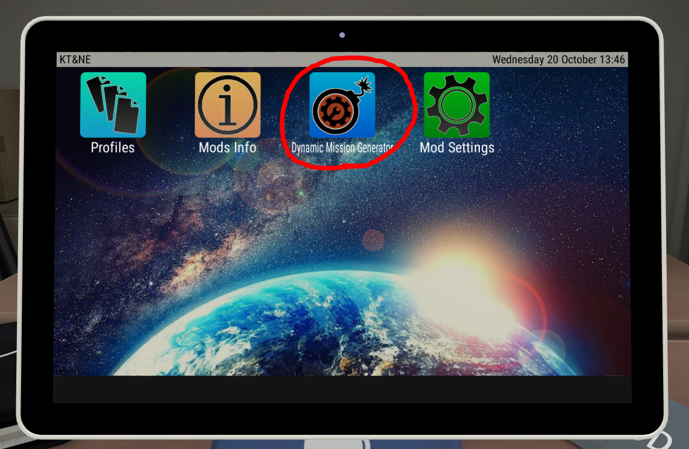
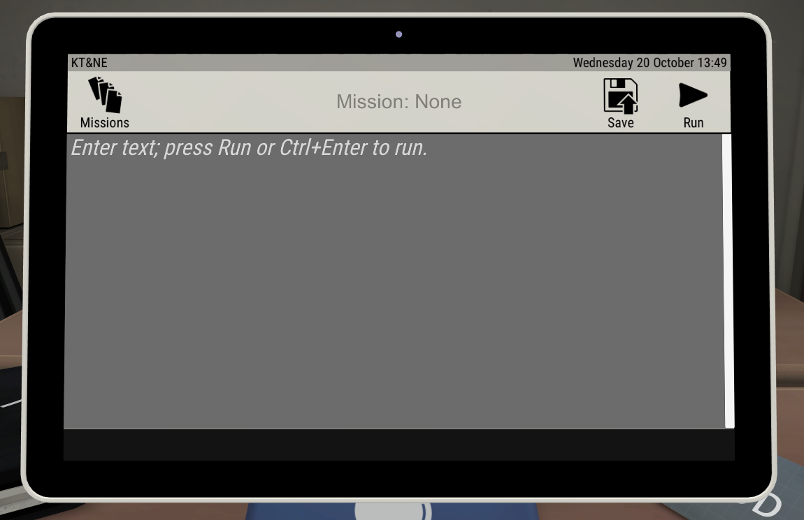
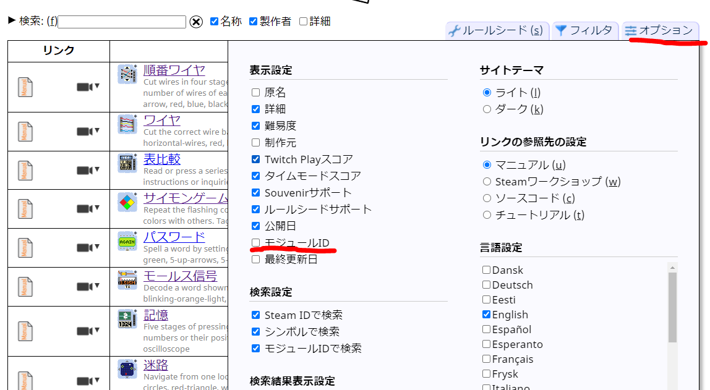
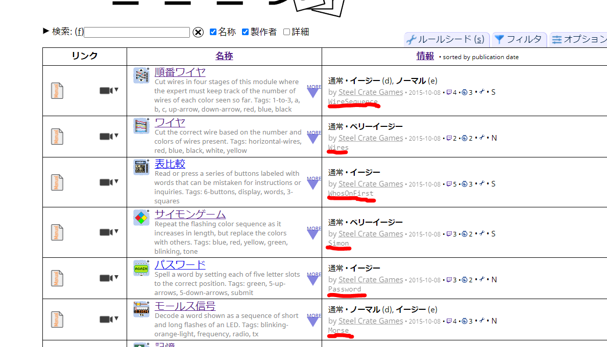

## DMGミッションの作り方

### [ダイナミックミッションジェネレータ(DMG)](https://steamcommunity.com/sharedfiles/filedetails/?id=1633427044)とは

* ミッションを文字列で記述してそれを実行してくれるMOD(要[Mod Selector](https://steamcommunity.com/sharedfiles/filedetails/?id=801400247))
* インストールすると、Mod Selectorのタブレットから起動できる




### 使い方

* ミッション文字列(後述)を入力して「Run」を入力すると爆弾が開始
* 「Save」を押すとミッション文字列を保存できる
* 「Missions」を押すと、保存したミッション文字列を読み込むことができる

### ミッション文字列について

以下全てスペース区切りか改行で複数入力できる。また、`//`以降はコメントとして扱う。

#### 爆弾設定

* `[モジュールID]` - モジュールを1つ出現させる
  * モジュールIDにスペースが含まれる場合、クォーテーションマーク(")で括らなければならない
  * モジュールIDの取得方法
    * [レポジトリ](https://ktane.timwi.de/?lang=ja)の「オプション」から「モジュールID」をチェック
      
    * モジュールIDが表示される
      
* `[個数]*[モジュールID]` - モジュールを指定個数出現させる
* `[グループ]` - グループから1つランダムでモジュールを出現させる
  * `ALL_SOLVABLE` - 全ての通常モジュール
  * `ALL_NEEDY` - 全ての特殊モジュール
  * `ALL_VANILLA` - バニラの通常モジュール
  * `ALL_MODS` - MODの通常モジュール
  * `ALL_VANILLA_NEEDY` - バニラの特殊モジュール
  * `ALL_MODS_NEEDY` - MODの特殊モジュール
  * `profile:[プロファイル名]` - プロファイルで有効化されている通常モジュール
  * `needyprofile:[プロファイル名]` - プロファイルで有効化されている特殊モジュール
  * `[モジュールID],[モジュールID],...` - モジュールIDでグループを指定
* `[個数]*[モジュールID/グループ]` - モジュールを複数/グループから複数(重複あり)出現させる
* `![個数]*[グループ]` - グループから重複を可能な限りなくして出現させる
* `[時間]:[分数]:[秒数]` - 時間を設定(デフォルトは2分)
* `[ミス数]X` - ミス数を指定
* `needyactivationtime:[秒数]` - 特殊モジュールが起動するまでの時間を指定
* `widgets:[個数]` - ウィジェット(バッテリー、インジケーターなど)の個数を指定
* `frontonly` - 爆弾の前面のみに出現するようにする

#### グローバル設定

* `nopacing` - お邪魔イベント(アラーム、停電など)をオフにする
* `room:[部屋名]` - 部屋を指定する
* `mode:[モード]` - モードを指定する
  * `normal` - (デフォルト)通常モード
  * `time` - タイムモード。解除をすると残り時間が増え、ミスをすると時間が減る。ミスの累積で爆破しなくなる。
  * `zen` - 禅モード。ミスの累積しなくなり、時間はカウントアップするようになる。練習に最適。
  * `steady` - 安定モード。ミスをしても時間が加速しなくなるが、時間が一定時間減少する。
  * `tm_[設定]`、`zm_[設定]`、`sm_[設定]` - それぞれ、タイム、禅、安定モードの設定を変更する
* `disableadvfeat:[true/false]` - 解除に有利なMODの設定を無効化/有効化する。無効化した場合、モード変更やHUDの表示ができなくなる
* `edgework:[true/false]` - エッジワークのHUDを有効化/無効化する
* `hud:[true/false]` - タイマーのHUDを有効化/無効化する
* `missionseed:[シード値]` - ミッションシードを固定する。一部のモジュールを除き、ウィジェットやモジュールの初期状態などが同じ状態で出現するようになる。
* `ruleseed:[シード値]` - [ルールシード](https://steamcommunity.com/sharedfiles/filedetails/?id=2037350348)を指定する。

#### 複数爆弾

以下、[Multiple Bombs](https://steamcommunity.com/workshop/filedetails/?id=806104225)MODが必要。

* `([爆弾設定]) ([爆弾設定]) ...` - 複数の爆弾を同時に出現させる。ファクトリー(後述)が有効な場合、1つずつ連続で解除する。
* `[個数]*([爆弾設定])` - 同じ設定の爆弾を複数出現させる
* 時間、ミス数などの設定をカッコの外に記述した場合、その記述以降すべての爆弾に設定が反映される。
* `factory:[モード]` - [ファクトリー](https://steamcommunity.com/sharedfiles/filedetails/?id=1307301431)モードを指定する
  * `static` - (デフォルト)ファクトリーを使わない
  * `finite` - 指定個数の爆弾を連続で解除する。ミス数・時間は爆弾ごと
  * `finitegtime` - 指定個数の爆弾を連続で解除する。ミス数は爆弾ごと、時間は全爆弾共通
  * `finitegstrikes` - 指定個数の爆弾を連続で解除する。時間は爆弾ごと、ミス数は全爆弾共通
  * `finitegtimestrikes` - 指定個数の爆弾を連続で解除する。ミス数・時間は全爆弾共通
  * `infinite` - 爆破するまで連続で解除する。ミス数・時間は爆弾ごと
  * `infinitegtime` - 爆破するまで連続で解除する。ミス数は爆弾ごと、時間は全爆弾共通
  * `infinitegstrikes` - 爆破するまで連続で解除する。時間は爆弾ごと、ミス数は全爆弾共通
  * `infinitegtimestrikes` - 爆破するまで連続で解除する。ミス数・時間は全爆弾共通

  
### 設定例

```
// (ここはコメント)
// 5つのランダムな通常モジュールを出現させる
// 時間30分、ミス数5、ポータル部屋

5*ALL_SOLVABLE 
30:00 5X
room:portal_room
```

```
// player1プロファイル、player2プロファイルから5つずつ、soloプロファイルから1つ
// 時間1時間、ミス数5、デフォルト部屋
// HUD有効

5*profile:player1
5*profile:player2
profile:solo
1:00:00 5X

room:default
disableadvfeat:false
edgework:true hud:true
```

```
// Factory有限モード 時間・ミスは共有
// 爆弾はそれぞれFIN、FMN、FT+ランダムMOD通常9個+ランダムMOD特殊
// HUD有効
(3X 40:00 forgetItNot 10*ALL_MODS ALL_MODS_NEEDY)
(4X 50:00 MemoryV2 10*ALL_MODS ALL_MODS_NEEDY)
(5X 1:00:00 forgetThis 10*ALL_MODS ALL_MODS_NEEDY)

factory:finite
disableadvfeat:false
edgework:true hud:true
```