## ミッションの作り方

### UnityとVisual Studioのダウンロード

* [Unityサイト](https://unity3d.com/jp/get-unity/download)から「Unity Hub をダウンロード」を選択し、Unity Hubをインストールする。
* [Unityアーカイブ](https://unity3d.com/jp/get-unity/download/archive)の**Unity 2017.4.22**のUnity Hub↓を選択する。
  * Unity Hubが起動するので、インストールする。
  <!-- * 「MonoDevelop / Unity Debugger」と「Microsoft Visual Studio Community 2017」が追加でインストールする。その他はあってもなくてもOK。-->


### Modkitのダウンロード

* [ModkitのGithub](https://github.com/Qkrisi/ktanemodkit)からダウンロードして解凍する。

  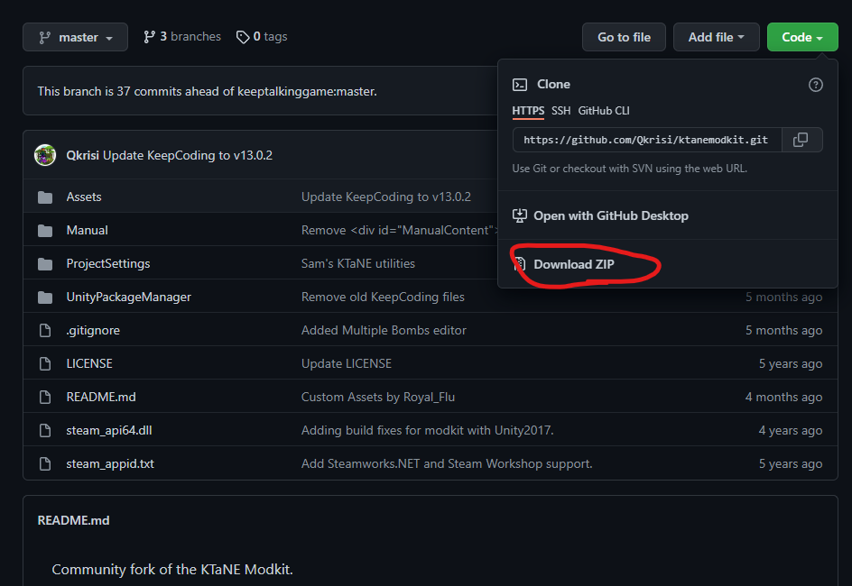

* Unity Hubの「リストに追加」から解凍したModkitを開くと次のような画面が開く

  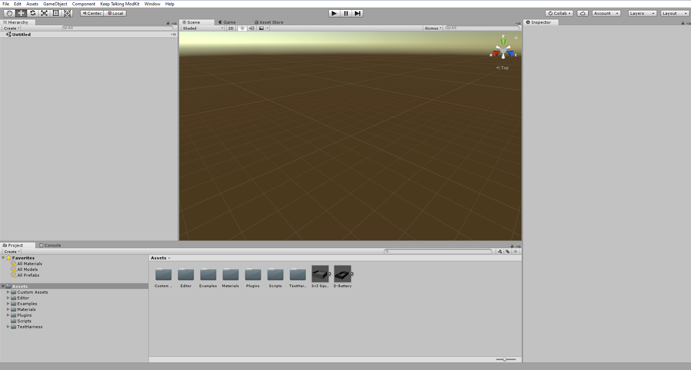

### DMGミッションファイルの作成

* DMGミッションファイルの作成方法は[DMGミッションの作り方]を参考にする。ただし、`nopacing`以外のグローバル設定は設定できない。
* 以下の記述方法でミッション名とミッション詳細を指定できる
  * 注意: ミッション名やミッション詳細に日本語名を指定すると一部の漢字が表示されなくなるので、アルファベットで記載する。

```
//// ミッション名(「/」を4つ)
/// ミッション詳細1行目(「/」を3つ)
/// ミッション詳細2行目
...
```

例:
```
//// Test Mission
/// This is a test mission.
/// Please enjoy!
/// 3 bombs with 1 boss, 1 needy and 9 random modules. Factory mode 

(3X 40:00 forgetItNot 9*ALL_MODS ALL_MODS_NEEDY)
(4X 50:00 MemoryV2 9*ALL_MODS ALL_MODS_NEEDY)
(5X 1:00:00 forgetThis 9*ALL_MODS ALL_MODS_NEEDY)

factory:finite
```

### DMGミッションファイルのインポート

* 次の「Load DMG Mission File」をクリックし、DMGミッションファイルのインポートする
  * DMGの「Save」から保存した場合、`C:\Users\<ユーザー名>\AppData\LocalLow\Steel Crate Games\Keep Talking and Nobody Explodes\DMGMissions`に保存されている

  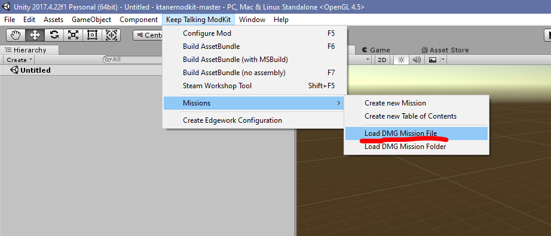

* 複数のDMGミッションファイルを作成した場合は、それを1つのフォルダに集め、「Load DMG Mission Folder」で一気にインポートできる。

### 目次の作成

* 次の「Create new Table of Contents」をクリックすると、「TableOfContents」というファイルが作成される。

  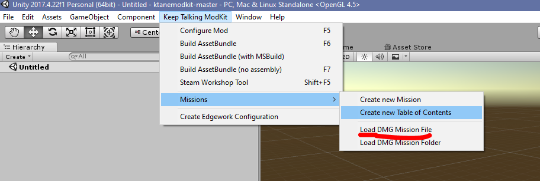
  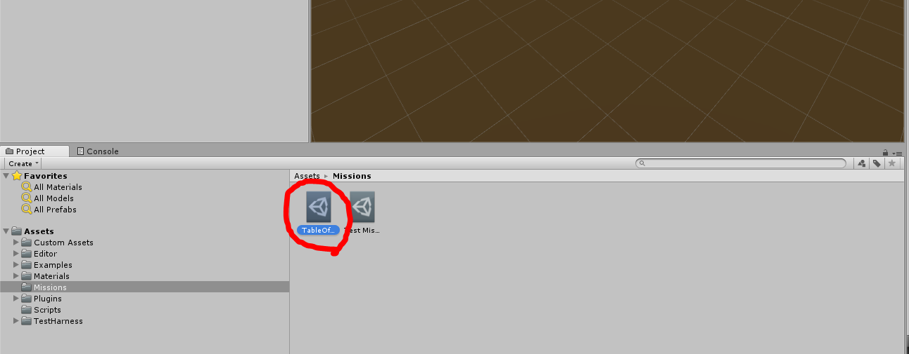

* 右のパネルからタイトルを設定する。

  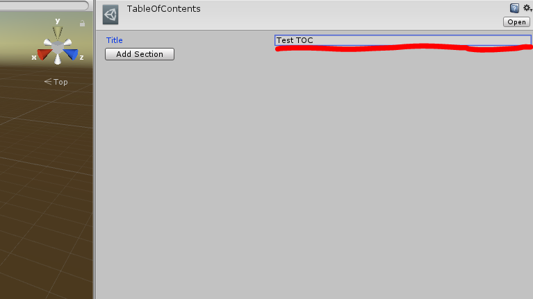

* 「Add Section」クリックして新しい章を追加する。

  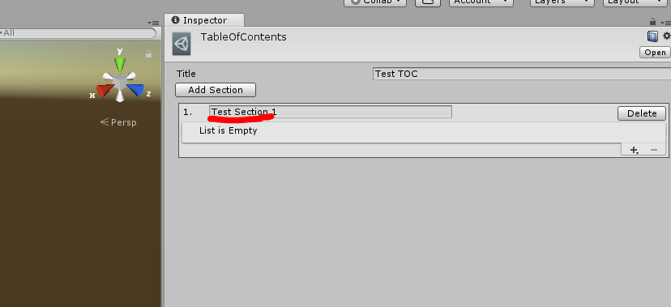

* 「+」をクリックして作成したミッションを追加する


  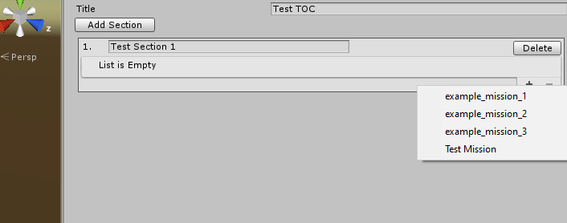


### MODを設定・ビルド

* 「Configure Mod」をクリックして、設定画面を開く

  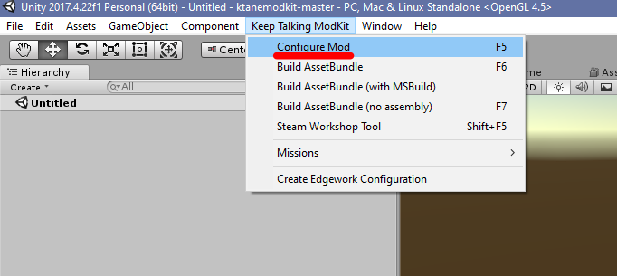

* 右側の設定を埋める
  * Id - 他のMOD名と被らないようなMODのID。例: `tepel_test_missions`
  * Title - MODのタイトル。例: `tepel's Test Missions`
  * Author - MODの作成者
  * Description - MODの内容。Steamのページに表示される
  * Version - バージョン。アップデートしたときにバージョンを上げるとバグが起きたときに便利。
  * Output Folder - MODのビルド先。
    * `C:\Program Files (x86)\Steam\steamapps\common\Keep Talking and Nobody Explodes\mods`に指定する。別の場所にゲームをインストールした場合、そこの`mods`フォルダを指定する。
    * `mods`フォルダが存在しない場合、作成しておく。
  * Preview Image - steamやMOD管理画面で表示される画像
    * 画像を設定するには、まずファイルを以下の位置にドラッグドロップする

      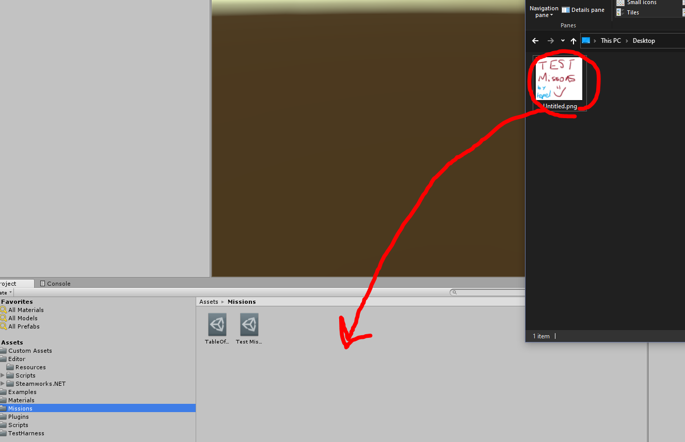

    * その後、Preview Imageの位置にドラッグドロップする

      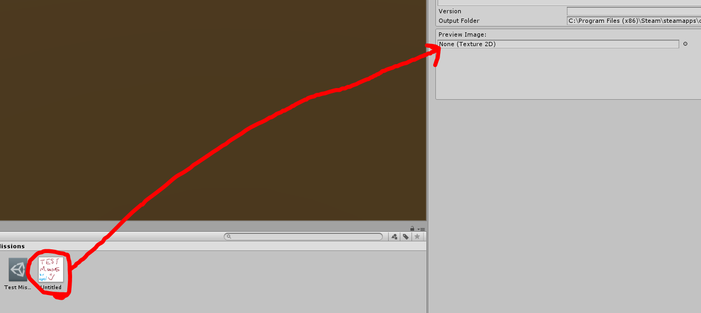

* 「Build AssetBundle」をクリックして、ビルドする。
  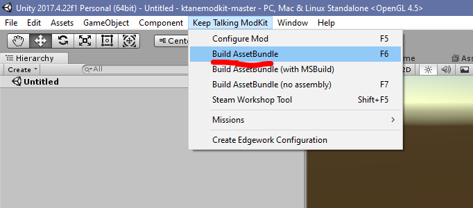

* ゲームを起動して、ミッションが追加されていることを確認する

### Steamに公開する

* 「Steam Workshop Tools」をクリックする
  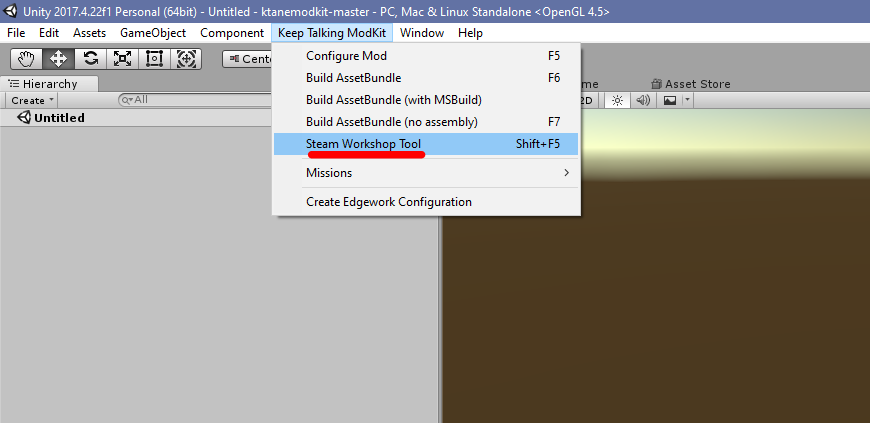
* 「Tags」の「Missions」を選択し、「Change Notes」に変更点(最初の場合は「リリース」などで良い)を入力する
  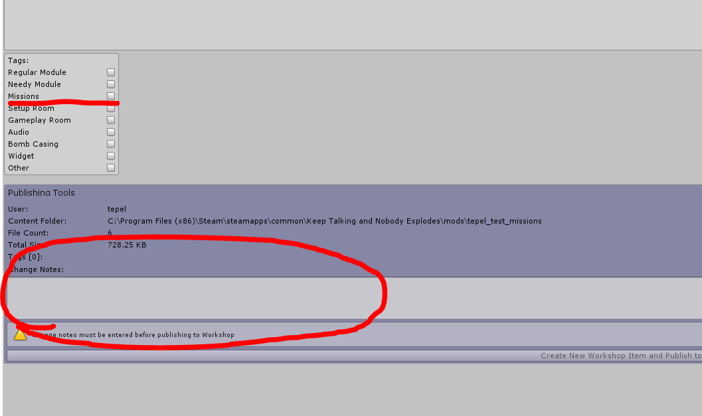
* 「Create New Workshop Item and Publish to Steam」をクリックして公開する
  * グレーアウトして選択できない場合、一度右上のxをくりっくして「Steam Workshop Tools」のクリックからやり直す。
  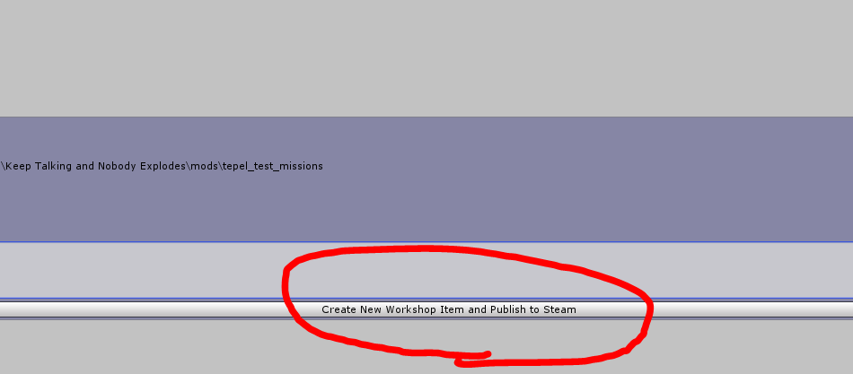