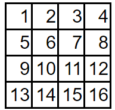
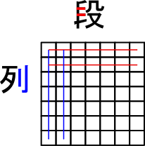
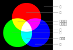

---
layout: default
title: 知っておくと便利な概念
description: MODで頻出する概念です。使いこなせればあなたも中級者。
lang: ja_JP
---

## 知っておくと便利な用語

### 読み順
通常は、*英語の文章を*読む順番。~~日本語は縦書きもあるからややこしい。~~

例えば、4×4の格子ならば次のような順番。

  
モジュール例:

  <ul>
    <li><a href="https://ktane.timwi.de/HTML/Decolored%20Squares%20translated%20(%E6%97%A5%E6%9C%AC%E8%AA%9E%20%E2%80%94%20%E8%89%B2%E6%8A%9C%E3%81%8D%E6%A0%BC%E5%AD%90)%20(tchen).html">色抜き格子</a></li>
    <li><a href="https://ktane.timwi.de/HTML/The%20Screw%20translated%20(%E6%97%A5%E6%9C%AC%E8%AA%9E%20%E2%80%94%20%E3%82%B6%EF%BD%A5%E3%83%8D%E3%82%B8)%20(tchen).html">ザ・ネジ</a></li>
    <li><a href="https://ktane.timwi.de/HTML/Minesweeper%20translated%20(%E6%97%A5%E6%9C%AC%E8%AA%9E%20%E2%80%94%20%E3%83%9E%E3%82%A4%E3%83%B3%E3%82%B9%E3%82%A4%E3%83%BC%E3%83%91%E3%83%BC)%20(tchen).html">マインスイーパー</a></li>
  </ul>

### 「段」と「列」

下の図で、赤の矢印の方向が「段」、青が「列」。

余談ではあるが、現実には同様に「行」と「列」で表す場合もある(数学の行列やExcelなど)が、マニュアルではすべて「段」と「列」に統一している。

  
モジュール例:

  <ul>
    <li><a href="https://ktane.timwi.de/HTML/Colored%20Squares%20translated%20(%E6%97%A5%E6%9C%AC%E8%AA%9E%20%E2%80%94%20%E8%89%B2%E4%BB%98%E3%81%8D%E6%A0%BC%E5%AD%90)%20(tchen).html">色付き格子</a></li>
    <li><a href="https://ktane.timwi.de/HTML/Battleship%20translated%20(%E6%97%A5%E6%9C%AC%E8%AA%9E%20%E2%80%94%20%E6%B5%B7%E6%88%A6%E3%82%B2%E3%83%BC%E3%83%A0)%20(tchen).html">海戦ゲーム</a></li>
    <li><a href="https://ktane.timwi.de/HTML/Coordinates%20translated%20(%E6%97%A5%E6%9C%AC%E8%AA%9E%20%E2%80%94%20%E5%BA%A7%E6%A8%99)%20(alpha8404).html">座標</a></li>
  </ul>

### 数字根

ある数字のそれぞれの桁の数字を合計するという動作を、数字が一桁になるまで繰り返したときの値。

例: 98213 → 9+8+2+1+3=23 -> 2+3=5 であるから、98213の数字根は5。

次のような性質がある: 
* 数字根が0になる0以上の整数は0だけ。正の整数の数字根は1~9の値になる。
* 数字を9で割ったときの値を求めると、あまりが0のときは数字根は9であり、あまりが1~8のときはその値が数字根となる。
* したがって、数字根を素早く求めるには、9で割ったときの値を求めればよい。
  * 例1: 98213では、9と8+1がどちらも9の倍数であるので、足し算に含めなくても9で割ったあまりは変化しない。つまり残りの2+3=5を求めれば良い。
  * 例2: 98217では、9、8+1、2+7のいずれも9の倍数であるので、9で割ったときのあまりは0である。したがって数字根は9。

  
モジュール例:

  <ul>
    <li><a href="https://ktane.timwi.de/HTML/Digital%20Root%20translated%20(%E6%97%A5%E6%9C%AC%E8%AA%9E%20%E2%80%94%20%E6%95%B0%E5%AD%97%E6%A0%B9)%20(tchen).html">数字根</a></li>
    <li><a href="https://ktane.timwi.de/HTML/Color%20Morse%20translated%20(%E6%97%A5%E6%9C%AC%E8%AA%9E%20%E2%80%94%20%E3%82%AB%E3%83%A9%E3%83%BC%E3%83%A2%E3%83%BC%E3%83%AB%E3%82%B9)%20(tchen).html">カラーモールス</a></li>
    <li><a href="https://ktane.timwi.de/HTML/The%20Number%20Cipher%20translated%20(%E6%97%A5%E6%9C%AC%E8%AA%9E%20%E2%80%94%20%E6%95%B0%E5%AD%97%E6%9A%97%E5%8F%B7)%20(alpha8404).html">数字暗号</a></li>
  </ul>

### mod演算

ある値を別の値で除算し、そのあまりを取得する演算。「~で割ったあまり」「~を~の範囲になるまで繰り返し~を減算する」といった表記で表されることが多い。

例: 13÷5 は2あまり3なので、13mod5は3となる。

負の数のmod演算については、モジュールによって挙動が異なるので注意する。

例1: 「-13を0~4の範囲になるまで繰り返し5を加算・減算する」という場合は、-13+3×5=2なので2である。
例2: 「-13を-4~4の範囲になるまで繰り返し5を加算・減算する」という場合は、-13+2×5=-3なので-3である。

以下のような性質が成り立つ。

* 加算・減算・乗算した結果をmodする場合、利用する数字を同じ値でmodしてから計算しても良い。
  * 例1: 「(123+432-82)mod9」は、「123mod9=6」「432mod9=0」「82mod9=1」より、「6+0-1=5」となる。
  * 例2: 「(3142×134)mod3」は「3142mod3=1」「134mod3=2」より「1×2=2」となる。
* 除算は利用する数字を同じ値でmodしてから計算することはできない場合がある。
  * 例: 「18mod4=2」「6mod4=2」であるが、「(18÷6)mod4=3」である。
  * 発展: 割る数とmodする数が*互いに素*である場合のみ、これは可能。「18mod5=3」「6mod5=1」であるから、「(18÷6)mod5=3」である。

  
モジュール例:

  <ul>
    <li><a href="https://ktane.timwi.de/HTML/Modulo%20translated%20(%E6%97%A5%E6%9C%AC%E8%AA%9E%20%E2%80%94%20%E3%83%A2%E3%82%B8%E3%83%A5%E3%83%AD)%20(alpha8404).html">モジュロ</a></li>
    <li><a href="https://ktane.timwi.de/HTML/Morsematics%20translated%20(%E6%97%A5%E6%9C%AC%E8%AA%9E%20%E2%80%94%20%E3%83%A2%E3%83%BC%E3%83%AB%E3%82%B9%E3%83%9E%E3%83%86%E3%82%A3%E3%83%83%E3%82%AF)%20(tchen).html">モールスマティック</a></li>
    <li><a href="https://ktane.timwi.de/HTML/The%20Colored%20Maze%20translated%20(%E6%97%A5%E6%9C%AC%E8%AA%9E%20%E2%80%94%20%E8%89%B2%E4%BB%98%E3%81%8D%E8%BF%B7%E8%B7%AF)%20(alpha8404).html">色付き迷路</a></li>
  </ul>

### アルファベットでの位置(A1Z26)

ある英字が、アルファベットで数えて何文字目であるかを数えた値。

|文字|値|文字|値|文字|値|文字|値|文字|値|
|---|---|---|---|---|---|---|---|---|---|
|A|1|B|2|C|3|D|4|E|5|
|F|6|G|7|H|8|I|9|J|10|
|K|11|L|12|M|13|N|14|O|15|
|P|16|Q|17|R|18|S|19|T|20|
|U|21|V|22|W|23|X|24|Y|25|
|Z|26|||||||||

ただし、モジュールによってはA=0、B=1...Z=25と数えるものや、Z=0、A=1...Y=25と数えるものもあるため注意。(通常はA=1、B=2...Z=26と明記されている)

  
モジュール例:

  <ul>
    <li><a href="https://ktane.timwi.de/HTML/Two%20Bits%20translated%20(%E6%97%A5%E6%9C%AC%E8%AA%9E%20%E2%80%94%20%E3%83%84%E3%83%BC%E3%83%93%E3%83%83%E3%83%84)%20(tchen).html">ツービッツ</a></li>
    <li><a href="https://ktane.timwi.de/HTML/Morsematics%20translated%20(%E6%97%A5%E6%9C%AC%E8%AA%9E%20%E2%80%94%20%E3%83%A2%E3%83%BC%E3%83%AB%E3%82%B9%E3%83%9E%E3%83%86%E3%82%A3%E3%83%83%E3%82%AF)%20(tchen).html">モールスマティック</a></li>
    <li><a href="https://ktane.timwi.de/HTML/Perspective%20Pegs%20translated%20(%E6%97%A5%E6%9C%AC%E8%AA%9E%20%E2%80%94%20%E5%A5%A5%E8%A1%8C%E3%81%8D%E3%83%9A%E3%82%B0)%20(tchen).html">奥行きペグ</a></li>
  </ul>

### n進法(二進法、十六進法、三十六進法など)

数字を表す方法の種類。普段は十進法を利用しているが、これは一の位、十の位、百の位、千の位...がそれぞれ、100、101、102、103...の個数を表していると考えることができる。

例: 31528 = 3×104 + 1×103 + 5×102 + 2×101 + 8×100

二進法では2つの数字「0」と「1」しか利用しない。そして、一の位、十の位、百の位、千の位...がそれぞれ、20、21、22、23...を表す。

例: 10110 = 1×24 + 0×23 + 1×22 + 1×21 + 0×20 = 16 + 4 + 2 = 22

同様に、n進法ではn個の数字を使って、一の位、十の位、百の位、千の位...がそれぞれ、n0、n1、n2、n3...の個数を表す、といった具合で数字を表現する。11個以上の数字を利用する場合は、英字を用いてA=11、B=12...のように利用する場合が多い。

例: 三十六進法(A=11, B=12...Z=35)で、CH3N = 12×363 + 17×362 + 3×361 + 23×360 = 559872 + 22032 + 108 + 23 = 582035

  
モジュール例:

  <ul>
    <li><a href="https://ktane.timwi.de/HTML/21%20translated%20(%E6%97%A5%E6%9C%AC%E8%AA%9E%20%E2%80%94%2021)%20(tchen).html">21</a></li>
    <li><a href="https://ktane.timwi.de/HTML/Error%20Codes%20translated%20(%E6%97%A5%E6%9C%AC%E8%AA%9E%20%E2%80%94%20%E3%82%A8%E3%83%A9%E3%83%BC%E3%82%B3%E3%83%BC%E3%83%89)%20(alpha8404).html">エラーコード</a></li>
    <li><a href="https://ktane.timwi.de/HTML/Forget%20This%20translated%20(%E6%97%A5%E6%9C%AC%E8%AA%9E%20%E2%80%94%20%E4%B9%8B%E5%BF%98%E3%82%8B)%20(tchen).html">之忘る</a></li>
  </ul>

### 加法混色

色を混ぜて別の色を作るときの考え方の一つ(参考: ↔減法混色)。

赤、緑、青を三原色とし、それらを混ぜることによって他の色を表現する。色を加えれると明るくなり、除くと暗くなる。

色を混ぜたときの名前は以下のように表現されることが多い。

  
モジュール例:

  <ul>
    <li><a href="https://ktane.timwi.de/HTML/7%20translated%20(%E6%97%A5%E6%9C%AC%E8%AA%9E%20%E2%80%94%207)%20(hatosable).html">7</a></li>
    <li><a href="https://ktane.timwi.de/HTML/Color%20Addition%20translated%20(%E6%97%A5%E6%9C%AC%E8%AA%9E%20%E2%80%94%20%E8%89%B2%E3%81%AE%E5%8A%A0%E7%AE%97)%20(alpha8404).html">色の加算</a></li>
    <li><a href="https://ktane.timwi.de/HTML/Multicolored%20Switches%20translated%20(%E6%97%A5%E6%9C%AC%E8%AA%9E%20%E2%80%94%20%E8%89%B2%E3%81%A9%E3%82%8A%E3%82%B9%E3%82%A4%E3%83%83%E3%83%81)%20(hatosable).html">色どりスイッチ</a></li>
  </ul>

<!-- ### 論理演算

### ビット演算

## コミュニケーションで使えるテクニック

### NATOフォネティックコード

### 「海戦ゲーム」座標 -->