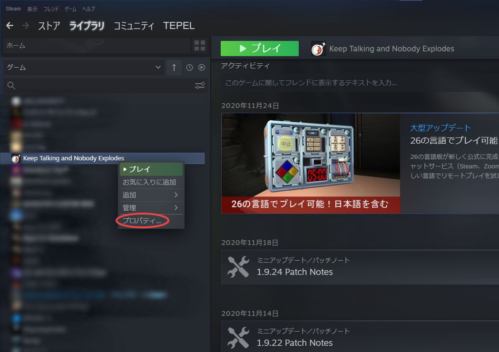

## Steam WorkshopのMODをアップデートする方法

基本的に、MODは自動的にアップデートされますが、そのタイミングはSteamの気分次第なところがあります。
強制的にMODのアップデートを行うための手順を紹介します。

**以下はKeep Talking and Nobody ExplodesのSteam WorkshopのMODのみを対象としています。その他のゲームのMODに関しては、正しく動作するかは不明です。**

1. Steamクライアントを開き、ライブラリのホームに移動する。
2. Keep Talking and　Nobody Explodesを右クリックし、「プロパティ...」を開く
3. 「ローカルファイル」の「ゲームファイルの整合性を確認」を押す。

※しばらく時間がかかることがあります。

